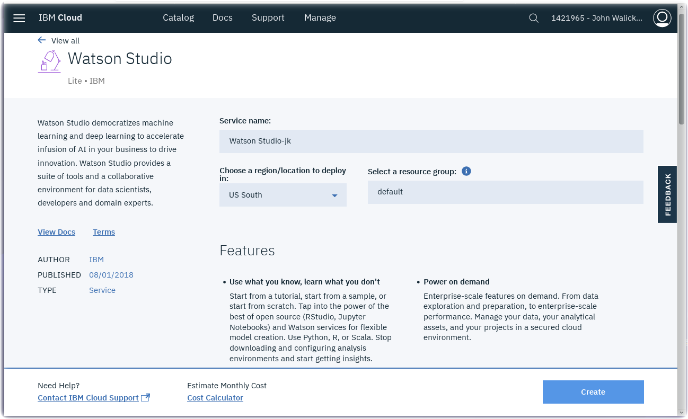

*Quick links :*
[Home](/README.md) - [Flooding](FLOODING.md) - [**Watson Studio**](STUDIO.md) - [Visual Recognition Model](VISRECO.md) - [Test and Deploy](VRMTEST.md)
***

# Watson Studio Set up and Configuration in IBM Cloud

## Lab Objectives

In this lab you will set up Watson Studio with a new Project.  You will learn:

- Watson Studio
- How to set up a new Watson Studio Project

### Introduction

Watson Studio accelerates the machine and deep learning workflows required to infuse AI into your business to drive innovation. It provides a suite of tools for data scientists, application developers and subject matter experts, allowing them to collaboratively connect to data, wrangle that data and use it to build, train and deploy models at scale. Successful AI projects require a combination of algorithms + data + team, and a very powerful compute infrastructure.

- Learn more from the Experts - [Introducing IBM Watson Studio](https://medium.com/ibm-watson/introducing-ibm-watson-studio-e93638f0bb47)

### Watson Studio Setup

#### Log into Watson Studio

- If you created a **Watson Studio** service instance in a prior lab, you can relaunch Watson Studio by visiting [http://dataplatform.cloud.ibm.com](http://dataplatform.cloud.ibm.com/)
- Skip the next **Create a Watson Studio service instance** section if you do not need to create a new Watson Studio instance. (Only one Watson Studio instance is allowed per IBM Cloud Lite account).  Jump to the **Watson Studio Projects** section.
- If you want to learn how to navigate the [IBM Cloud Dashboard](https://cloud.ibm.com), click on [Services](https://cloud.ibm.com/resources), then search for *studio* in the masthead.
  - **Tip:** Here's a shortcut to locate [your Watson Studio instance](https://cloud.ibm.com/resources?search=studio)
  
  - Click on the Watson Studio instance to open and launch Watson Studio.

#### Create a Watson Studio service instance
- Create a **Watson Studio** service instance from the [IBM Cloud Catalog](https://cloud.ibm.com/catalog/?search=studio)
- Search on **Studio** in the IBM Cloud Catalog

- Click on the **Watson Studio** service tile

- Click on the **Create** button
- After the Watson Studio service is created, click on **Get Started** or visit Watson Studio at <https://dataplatform.cloud.ibm.com/>

- Login with your IBM Cloud account
- Walk through the introductory tutorial to learn about Watson Studio

### Watson Studio Projects

Projects are your workspace to organize your resources, such as assets like data, collaborators, and analytic tools like notebooks and models

#### Create a New Project

- Click on **Create a Project**

- Select the **Visual Recognition** tile and press the **Create Project** button

- Select a region for Visual Recognition

- Watson Studio will spin for a few seconds while **Preparing Watson Studio** project.  New instances of Watson Visual Recognition and Cloud Object Storage will be created.

- Give your Project a name : **Flooding**
- The new Cloud Object Storage instance will be prefilled.
- The new Watson Visual Recognition service instance will be prefilled.

- Press the **Create** button

You are ready to set up your Project with Watson Visual Recognition. Proceed to the next [step](VISRECO.md)

***
*Quick links :*
[Home](/README.md) - [Flooding](FLOODING.md) - [**Watson Studio**](STUDIO.md) - [Visual Recognition Model](VISRECO.md) - [Test and Deploy](VRMTEST.md)
