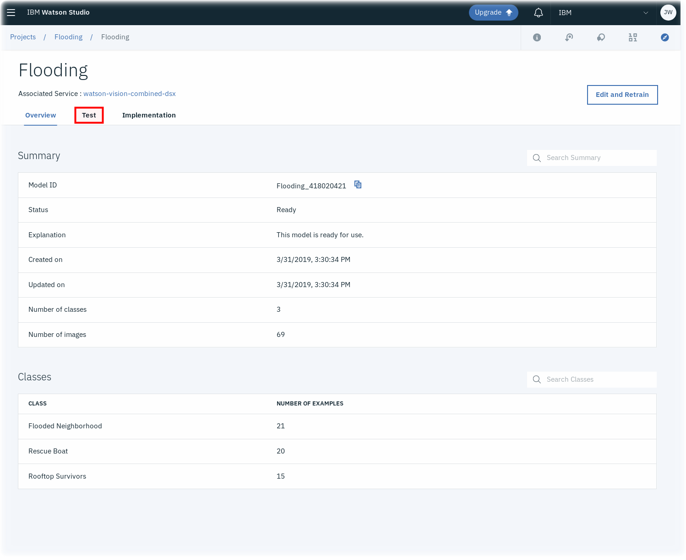
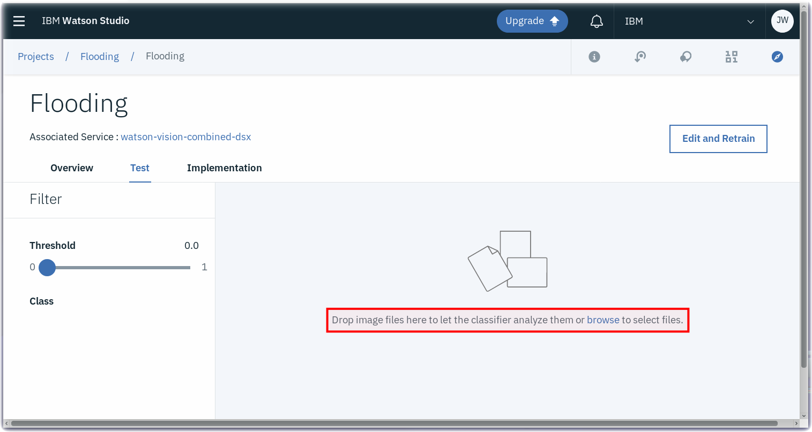
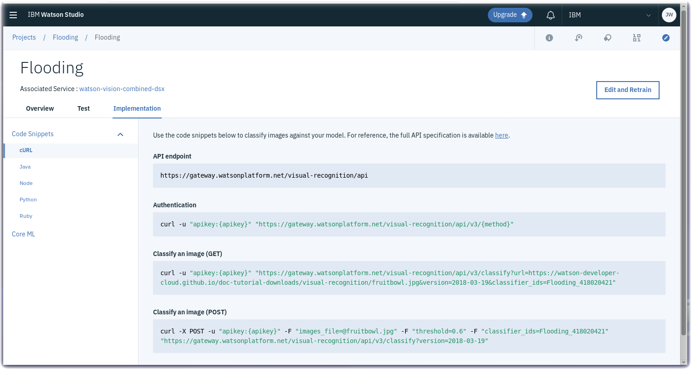

*Quick links :*
[Home](/README.md) - [Flooding](FLOODING.md) - [Watson Studio](STUDIO.md) - [Visual Recognition Model](VISRECO.md) - [**Test and Deploy**](VRMTEST.md)
***

## Lab Objectives

In this lab you will use sample images to confirm your Visual Recognition model. You will learn:

- How to test your Visual Recognition model using sample images
- How to incorporate your Visual Recognition Custom Classifier model into your applications

#### Review and Test
- Review the Classes and Model details
- Click on the **Test** tab



### Test Watson Visual Recognition Custom Classifier with sample images
- Visit the [Test Data directory](testdata) and **download** the testdata.zip file.
- Unzip the images and inspect a few of the drone images of flood zones.
- These images were not part of the training set and will be used to validate the visual recognition model.
- Upload the images into the **Test** page by browsing / dragging the images into the Test page



- Inspect the scores returned by the Watson Visual Recognition Custom Classifier


### Implement Watson Visual Recognition custom model in your Applications
- You can incorporate this Watson Visual Recognition Custom Classifier model into your applications using a variety of programming languages - Java, Node, Python, Ruby, Core ML
- Click on the **Implementation** tab to review the Code snippets



Use the code snippets below to classify images against your model. For reference, the full API specification is available [here](https://www.ibm.com/watson/developercloud/visual-recognition/api/v3/)

- **API endpoint**

  ```
  https://gateway.watsonplatform.net/visual-recognition/api
  ```

- **Authentication**

  ```
  curl -u "apikey:{apikey}" "https://gateway.watsonplatform.net/visual-recognition/api/{method}"
  ```

- **Classify an image (GET)**

  ```
  curl -u "apikey:{apikey}" "https://gateway.watsonplatform.net/visual-recognition/api/v3/classify?url=https://watson-developer-cloud.github.io/doc-tutorial-downloads/visual-recognition/fruitbowl.jpg&version=2018-03-19&classifier_ids=Flooding_418020421"
  ```

- **Classify an image (POST)**

  ```
  curl -X POST -u "apikey:{apikey}"-F "images_file=@fruitbowl.jpg" -F "threshold=0.6" -F "classifier_ids=Flooding_418020421" "https://gateway.watsonplatform.net/visual-recognition/api/v3/classify?version=2018-03-19"
  ```

### Congratulations
  You have completed the Drone Visual Recognition Lab and have surveyed flood damaged neighborhoods, identified homes with survivors on rooftops and detected rescue boats.


### Visual Recognition - Additional References
- [Call for Code Visual Recognition](https://developer.ibm.com/callforcode/resources/visual-recognition/)
- [Identify Cities from Space](https://developer.ibm.com/code/patterns/identify-cities-from-space/)
- [Locate and count items with object detection](https://developer.ibm.com/code/patterns/locate-and-count-items-with-object-detection/)
- [Classify vehicle damage images](https://developer.ibm.com/code/patterns/classify-vehicle-damage-images/)

*Quick links :*
[Home](/README.md) - [Flooding](FLOODING.md) - [Watson Studio](STUDIO.md) - [Visual Recognition Model](VISRECO.md) - [**Test and Deploy**](VRMTEST.md)
