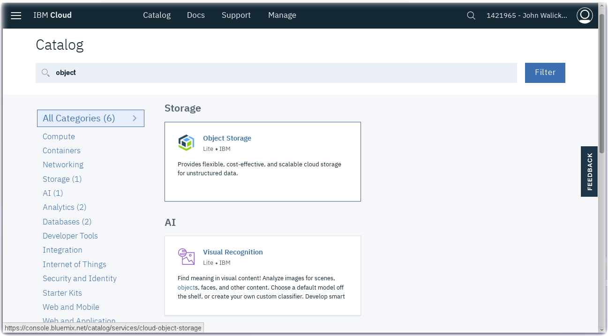
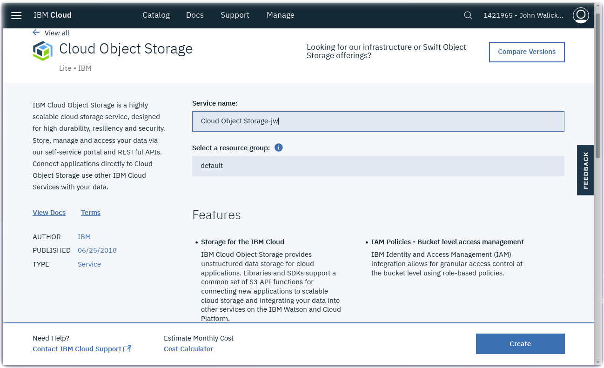
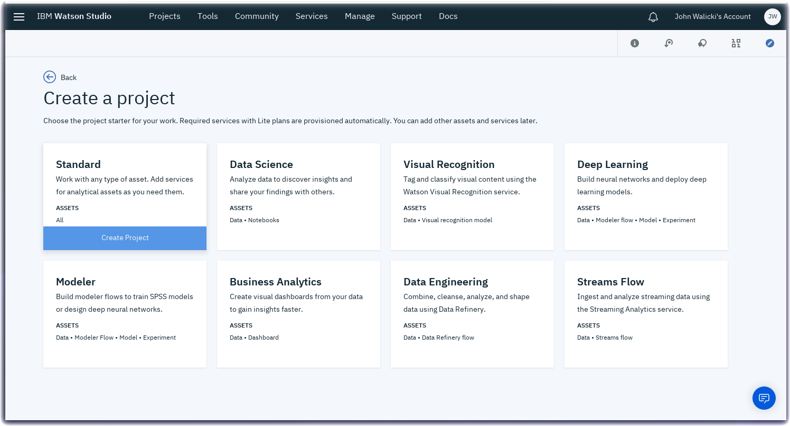
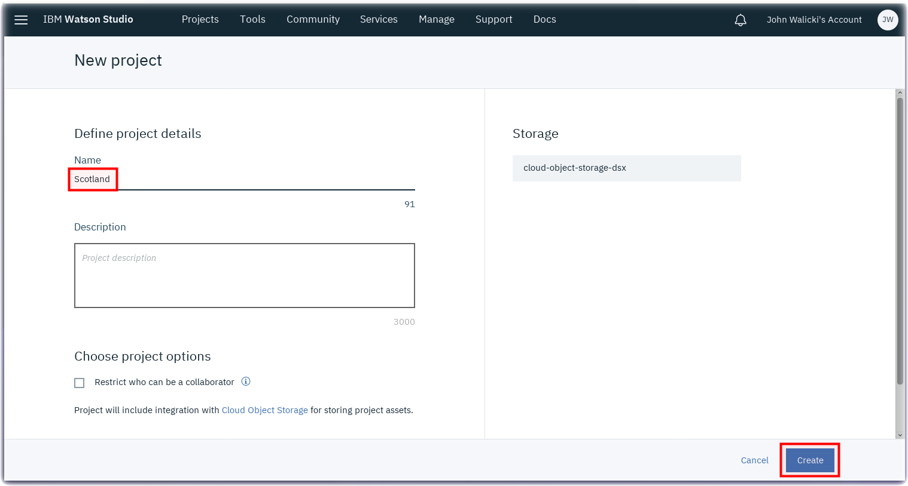

*Quick links :*
[Home](/README.md) - [Scotland](SCOTLAND.md) - [**Watson Studio**](STUDIO.md) - [Visual Recognition Model](VISRECO.md) - [Test and Deploy](VRMTEST.md)
***

# Watson Studio Set up and Configuration in IBM Cloud

## Lab Objectives

In this lab you will set up Watson Studio with a new Project.  You will learn:

- Watson Studio
- How to set up a new Watson Studio Project

### Introduction

Watson Studio accelerates the machine and deep learning workflows required to infuse AI into your business to drive innovation. It provides a suite of tools for data scientists, application developers and subject matter experts, allowing them to collaboratively connect to data, wrangle that data and use it to build, train and deploy models at scale. Successful AI projects require a combination of algorithms + data + team, and a very powerful compute infrastructure.

- Learn more from the Experts - [Introducing IBM Watson Studio](https://medium.com/ibm-watson/introducing-ibm-watson-studio-e93638f0bb47)

### Watson Studio Setup

#### Create **Cloud Object Storage**

- Create a Cloud Object Storage instance by visiting the [IBM Cloud Catalog](https://console.bluemix.net/catalog/?search=object)
- Search on **Object** in the IBM Cloud Catalog
- Click on the **Object Storage** service tile

- Click on the **Create** button

#### Create a Watson Studio service instance

- Create a **Watson Studio** service instance from the [IBM Cloud Catalog](https://console.bluemix.net/catalog/?search=studio)
- Search on **Studio** in the IBM Cloud Catalog

- Click on the **Watson Studio** service tile

- Click on the **Create** button
- After the Watson Studio service is created, click on **Get Started** or visit Watson Studio at <https://dataplatform.cloud.ibm.com/>

- Login with your IBM Cloud account
- Walk through the introductory tutorial to learn about Watson Studio

### Watson Studio Projects

Projects are your workspace to organize your resources, such as assets like data, collaborators, and analytic tools like notebooks and models

#### Create a New Project

- Click on **New project**
- Select the **Complete** tile and press the **OK** button

- Give your Project a name : **Scotland**
- The Cloud Object Storage instance created in an earlier step should be prefilled
- Press the **Create** button

You are ready to set up your Project with Watson Visual Recognition. Proceed to the next [step](VISRECO.md)

***
*Quick links :*
[Home](/README.md) - [Scotland](SCOTLAND.md) - [**Watson Studio**](STUDIO.md) - [Visual Recognition Model](VISRECO.md) - [Test and Deploy](VRMTEST.md)
